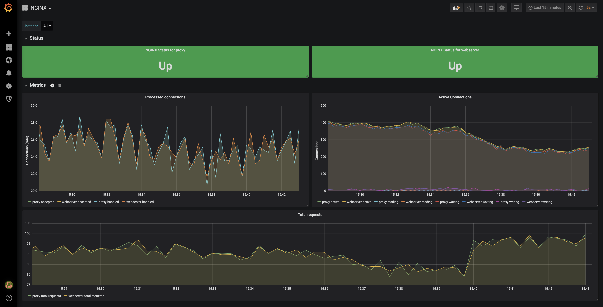

# Grafana Dashboard

We provide the official Grafana dashboard that visualizes the NGINX metrics exposed by the exporter. The dashboard
allows you to filter metrics per instance or see the metrics from all instances.

## Prerequisites

The dashboard has been tested with the following software versions:

- NGINX Prometheus Exporter >= 0.4.1
- Grafana >= v5.0.0
- Prometheus >= v2.0.0

A Prometheus data source needs to be [added](https://prometheus.io/docs/visualization/grafana/#using) before installing
the dashboard.

## Installing the Dashboard

In the Grafana UI complete the following steps:

1. Use the *New Dashboard* button and click *Import*.
2. Upload `dashboard.json` or copy and paste the contents of the file in the textbox and click *Load*.
3. Set the Prometheus data source and click *Import*.
4. The dashboard will appear. Note how you can filter the instance label just below the dashboard title (top left
   corner). This allows you to filter metrics per instance. By default, all instances are selected.

## Graphs

The dashboard comes with 2 rows with the following graphs for NGINX metrics:

- Status
  - Up/Down graph per instance. It shows the `nginx_up` metric.
- Metrics
  - Processed connections (`nginx_connections_accepted` and `nginx_connections_handled` metrics). This graph shows an
    [irate](https://prometheus.io/docs/prometheus/latest/querying/functions/#irate) in a range of 5 minutes. Useful for
    seeing the variation of the processed connections in time.
  - Active connections (`nginx_connections_active`, `nginx_connections_reading`, `nginx_connections_waiting` and
    `nginx_connections_writing`). Useful for checking what is happening right now.
  - Total Requests with an irate (5 minutes range too) of the total number of client requests
    (`nginx_http_requests_total`) over time.
